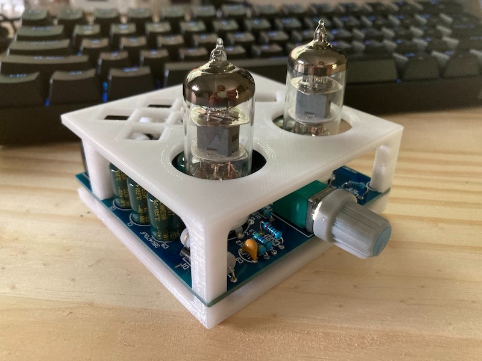
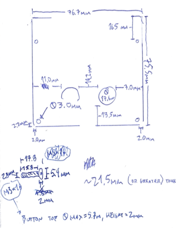
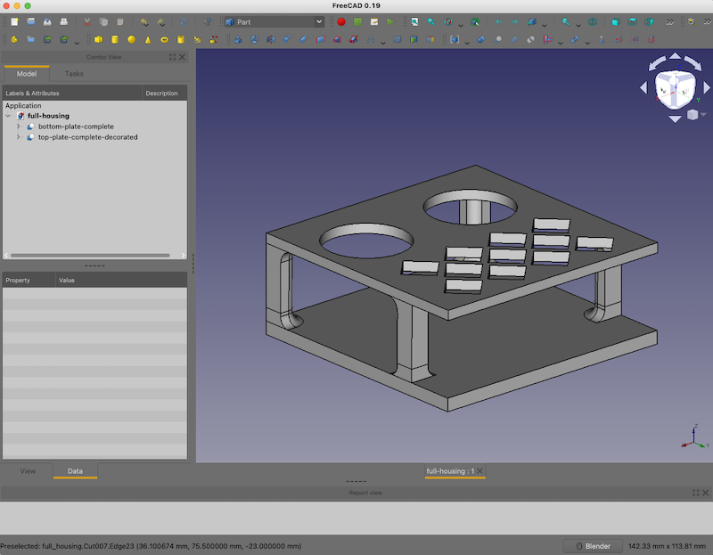
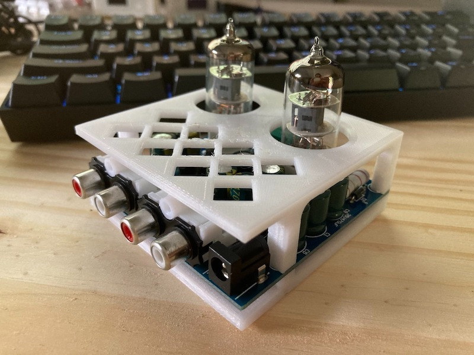

# tube-preamp-housing

## Description

A 3D-printed  "housing" to protect the kit vacuum tube-based preamplifier that I built.  (Sure, I know I could have simply paid the few extra dollars for the pre-made acrylic box that fits perfectly, but where's the fun in that?)

## Version History

### v1

Due to a bit of unfamiliarity on my part with some new PETG filament I'd acquired, I wasn't able to print anything taller than a couple of millimeters before the print lost adhesion to the printer bed.  Partly to have something "useful" to print while tweaking around settings to see what would remedy the problem, the design of the first housing was designed around that restraint and took the form of two flat planels joined to the circuit board via standoff screws.

While this design probably would have proved to be perfectly functional in the long run, I wasn't pleased with the top panel's cutout spacing for the vacuum tubes.  Given that it was my intention to try out a few different tubes to see which performs best, I fixed the spacing issue for the second attempt.

### v2

Having finally gotten all of my measurements and alignments (mostly) figured out, the second version of the housing is more or less complete until I manage to get ahold of some translucent filament again, for added effect.  This version makes use of four button-head screws that thread into cavities printed into the unibody panel+post pieces.  Unfortunately the bottom panel had to be printed a second time due to my not having taken into account the fact that "printing smoosh" would result in smaller-than-desired real-world cavities for these screws.

Additionally, my favorite new feature addition, the vented section towards the rear of the amplifier, came out looking a little uneven.  I'm pretty sure this is a result of my not having quite mastered the PETG I'm using.  I'd probably save myself a lot of hassle if I just stick to using PLA from here on out.